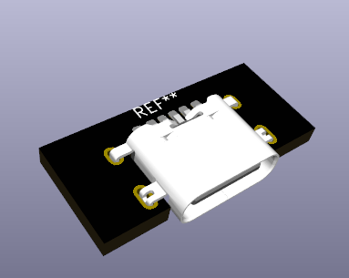
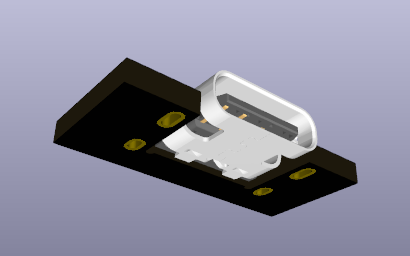

# USB4515-GF-A KiCAD Footprint Library 

  

This repo contains the KiCAD footprint for the [USB4515-GF-A](https://gct.co/connector/usb4515) mid-mount USB-C port, designed for power-only applications.

## Features
- SMT Type, Mid-Mount
- Optimized for power-only applications

  

## Getting Started

1. Clone this repo.
2. Import the library into your KiCAD project.
3. Profit 💡
